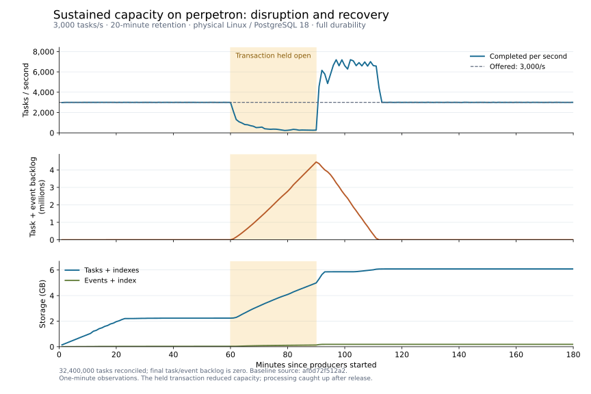

# Measured capacity

These measurements describe specific workloads and hardware, with synchronous task commits.
They are not throughput guarantees for arbitrary handlers. [Workloads and replay](README.md).

## Feed backfill

### Virtual transaction barrier, current implementation

2026-09-17, source `3564c01b5f8e4b5c6a8fd063e60ace752a82c0c0687a56a5c118d31308dada06`.
Registration uses one upsert, a captured virtual-transaction barrier and per-chunk generation
checks. No exclusive registration table lock, lock retries or compatibility fallbacks remain.

| Validation | Local macOS ARM64 | Perpetron, native Linux x86_64 |
|---|---:|---:|
| Python | 3.13.14 | 3.13.13 |
| Full `make checkall`, PostgreSQL 18.6 | 423 passed, 29 platform skips | 491 passed, 1 platform skip |
| Randomized six-second gap checks included above | 10 seeds | 50 seeds |
| PostgreSQL 16.14 feed/barrier/workflow/schema/CLI/upgrade tests | 111 passed | 111 passed |
| Real Linux sandbox tests included above | Not applicable | 25 passed |
| Clean base-wheel backfill/wait/ack smoke | Passed | Passed |

Lint, formatting, types, architecture, dependency checks and the dependency audit passed on
both machines. The unpublished Fronta 0.6.0 package itself is unavailable to the PyPI auditor;
its installed dependencies had no known vulnerabilities. Wheel and source distributions built.
The source fingerprint matches both installed-wheel smoke tests and both capacity reports.
The twenty barrier regressions cover forced old snapshots/late real XIDs followed by idle
transactions, read committed/repeatable read, commit/rollback/disconnect, hidden and disabled
activity, ordinary same-role/cross-role users without monitoring grants, restart before/during
capture, two resumers, later transactions, name replacement before/between chunks, blocker
warnings and progress while an existing reaction batch remains open.

Both capacity runs used eight workers, four producers, one million retained terminal tasks,
180,000 live tasks at a target 3,000/s, and a second 105,000-task phase with a transaction held
open for thirty seconds. Full durability was enabled. Local clients ran natively on macOS
against Docker Desktop PostgreSQL (512 MiB shared buffers, 2 GiB WAL target); perpetron used
native Linux clients and Docker PostgreSQL (2 GiB shared buffers, 4 GiB WAL target). These are
separate host measurements, not a controlled comparison of client platforms.

| Measure | Local macOS | Perpetron |
|---|---:|---:|
| Backfilled snapshots / chunks | 1,047,675 / 212 | 1,033,562 / 209 |
| Backfill duration | 12.12 s | 6.97 s |
| Reconciled task identities | 1,180,000 | 1,180,000 |
| Missing / unexpected identities | 0 / 0 | 0 / 0 |
| Accepted live/snapshot duplicates | 35,049 | 20,785 |
| Claim p99 around registration | 35.82 ms | 8.61 ms |
| Completions per full 5 s interval during the blocker | 11,730–16,151 | 14,883–14,925 |
| Contended consumer startup, including the 30 s blocker | 30.31 s | 30.11 s |
| Lock polls / mean client query duration | 117 / 9.26 ms | 120 / 2.25 ms |
| Maximum lock-poll client query duration | 143.04 ms | 8.39 ms |
| Completion p99 / maximum while waiting | 149.31 / 281.05 ms | 88.13 / 118.25 ms |
| Worker errors / bad task outcomes | 0 / 0 | 0 / 0 |
| Clean worker exits | 8 / 8 | 8 / 8 |

The consumer stayed pending for the held transaction, then completed; workers progressed in
every measured interval. Poll durations include scheduling and transport, and are not CPU-time
measurements or a claim of zero polling cost. Both final runs left zero event heap bytes and
zero dead tuples after two ordinary vacuums, with stable reusable index data. Index files did
not shrink to their initial empty size.
[macOS report](results/feed-backfill-vxid-macos.json),
[Linux report](results/feed-backfill-vxid-linux.json).

The [initial Linux run](results/feed-backfill-vxid-linux-initial.json) passed event reconciliation
and worker progress but failed the storage gate with 14,436 reported dead tuples. A
[diagnostic repeat](results/feed-backfill-vxid-vacuum-diagnostics.json) recorded zero remaining
tuples or tuples awaiting removal, but PostgreSQL bypassed index cleanup and left 491 dead
line pointers, which ANALYZE still counted. The benchmark now explicitly uses
`VACUUM (ANALYZE, INDEX_CLEANUP ON) fronta.events` for its two cleanup cycles and records that
command. Default AUTO may skip small index cleanups, so requiring zero afterward without
requesting cleanup was an incorrect harness assumption. Both hosts passed a fresh million-row
run with this correction; no production code or server configuration changed for it, and no
rewrite or `VACUUM FULL` was used. [PostgreSQL VACUUM documentation](https://www.postgresql.org/docs/18/sql-vacuum.html).

### Historical exclusive-lock implementation

The measurements below predate the virtual-transaction barrier and removal of old-schema
fallbacks. Their lock waits describe the rejected implementation, and their mixed-version
reports are historical evidence, not a supported deployment procedure. Current 0.6.0 clients
require `fronta db init` before use; the mixed-version backfill rehearsal has been removed.

#### Physical Linux, simplified source

2026-09-17, source `d18caad3c34f`, tested on `perpetron`: native Linux x86_64 clients,
Intel i5-13500T, 61 GiB RAM, Python 3.13.13 and PostgreSQL 18.6 in Docker. The copied sources
matched the local checkout before and after testing. Tests ran as an unprivileged user.

`make checkall` passed **471 tests**, including all **50 randomized gap checks** and **25 real
sandbox tests**; the single skip was the macOS-only rejection test. Lint, types, architecture,
dependency checks and the dependency audit passed. PostgreSQL **16.14** passed another **91**
feed, workflow, schema, CLI and rollout compatibility tests. Wheel/source builds and clean
installations passed; the installed base wheel performed a backfill and acknowledgement.

The standard feed matrix ran with full durability, 2 GiB shared buffers and a 4 GiB WAL target.
One million retained rows plus 180,000 live arrivals at 3,000/s reconciled **1,180,000 identities**
with **zero missing or unexpected events**. Backfill inserted **1,033,267 snapshots in 6.87 s**
over 209 chunks; delivery included 20,487 accepted live/snapshot duplicates. Claim p99 in the
ten seconds around registration was **8.56 ms**. All eight workers exited cleanly.

The contention run passed unchanged timing limits: five attempts took **11.92 s** overall,
with individual client-measured waits of **2.0017–2.0038 s** and completions between every pair
of attempts. Two ordinary vacuum cycles left zero heap bytes and dead tuples, with stable,
reusable index data at 45,858,816 bytes. Index files did not shrink to their initial size.
[Full Linux report](results/feed-backfill-linux.json).

The [Linux mixed-version rehearsal](results/feed-backfill-linux-rollout.json) delivered all
**10,100 identities** with two real v0.5.0 workers and two current workers, no pause during the
additive upgrade, no gaps, four clean exits and schema version 1 throughout.

#### Initial Docker Desktop measurement

2026-09-17, 0.6.0 development source `a95a883e4cae`, Linux ARM64 in Docker Desktop,
Python 3.13.15 and PostgreSQL 18.6. Eight workers at concurrency 256, four SDK producers with
eight clients each, one million retained terminal rows and 60 seconds of live arrivals at
3,000/s. PostgreSQL used 512 MiB shared buffers, a 2 GiB WAL target and full durability
(`fsync`, `synchronous_commit`, `full_page_writes` on). Steady ten-second completion windows
measured 2,998.7–3,000.2/s. This is a container capacity diagnostic, separate from the physical
host measurements below. [Full report](results/feed-backfill.json).

| Measure | Result |
|---|---:|
| Backfilled snapshots, including concurrent work | 1,031,716 |
| Duration / chunks | 6.35 s / 209 |
| Snapshot insert rate | 162,533 rows/s |
| Claim p50 / p99 in the ten seconds around registration | 2.87 / 9.59 ms |
| Slowest sampled claim in that window | 75.16 ms |
| Reconciled retained/live task identities | 1,180,000 |
| Delivered events / accepted live-snapshot duplicates | 1,198,960 / 18,960 |
| Missing / unexpected identities | 0 / 0 |
| Worker errors / bad task outcomes | 0 / 0 |
| Clean worker exits | 8 / 8 |

With a caller-owned enqueue held for 30 seconds during another 3,000/s live run, registration
failed after five lock attempts in **11.98 s**, leaving no registration or events for that name.
The database timeout was 2 s; client-measured attempts were 2.015–2.036 s including scheduling
and transport overhead (the harness allows 100 ms for that overhead). Between attempts,
1,223, 1,422, 838 and 507 tasks completed. All 1,285,000 tasks across both phases finished
successfully on their first attempt.

After consumption and two explicit ordinary vacuum cycles, the event heap was **0 bytes** with
**0 dead tuples**. Index data stayed at 46,243,840 bytes (44.1 MiB), reusable for later events;
the second vacuum allocated another 57,344 bytes of free-space maps. The data footprint
stabilized. **Total files did not return to their initial empty size:** ordinary vacuum does not
promise index-file shrinkage. The report preserves this failed literal size comparison alongside
the passing cleanup/stability check; no rewrite or `VACUUM FULL` was used.

The [mixed-version rehearsal](results/feed-backfill-rollout.json) kept two real v0.5.0 workers
alive through two additive `db init` applications, joined them with two new workers, and delivered
all **10,100 task identities** to a backfilling consumer. No gaps, no paused workers, four clean
exits, and schema version 1 throughout. The un-upgraded schema rejected explicit backfill with
the upgrade command while ordinary subscriptions continued working.

Functional validation: macOS `make checkall` passed (399 tests, 29 platform skips), with the
subsequently added concurrency and validation cases also passing. PostgreSQL 16 passed 89 feed,
workflow, schema and rollout checks. Linux ran the complete suite including 50 randomized
six-second gap tests: 468 passed, one platform skip and one existing process-limit test failed
because the runner was root. That test passed as an unprivileged user; the last-failure
`make checkall` rerun also passed lint, types, architecture, dependency checks and the audit.
The final large-negative-duration regression passed on both platforms. Wheel/source builds and
a clean base-wheel installation passed. There were no known dependency vulnerabilities.

## Release validation

Release source `a6c68e292ae7` passed the [CI matrix](https://github.com/dreo/fronta/actions/runs/35064552795)
across Python 3.12–3.14, PostgreSQL 16/18 and Linux/macOS, including real Linux sandboxes and
clean wheel/source installs. The physical Linux suite passed 374 tests with one platform skip.
The v0.4.0 upgrade rehearsal completed 50,000 tasks with no bad outcomes and 12 clean worker exits.
A [five-minute renewal run](results/release-renewals.json) held 2,000 concurrent one-minute tasks:
78 renewal batches, no expired leases and no reaped tasks.

## Final-source physical diagnostic

The same physical host and durable profile used below ran source `a6c68e292ae7` for ten minutes
at 3,000 arrivals/s, with an unrelated write transaction held from minute one to minute three.
It processed **1,800,000 tasks**, reconciled producer/completion identities, drained task/event
backlogs to zero and exited all eight workers cleanly. Overall completion rate, including final
drain, was **2,994.5/s**. Sampled backlog peaked at
**4,311** and returned to its ordinary range after the hold.

This is a short diagnostic, so its report deliberately does not pass the three-hour acceptance
grade. It verifies capacity and recovery on the final code; the earlier long run below provides
the retention/storage evidence. [Final physical report](results/release-physical.json).

## Release throughput

Three interleaved runs per workload, macOS clients and PostgreSQL 18 in Docker, source
`a6c68e292ae7`. The host had about 38 GB of swap in use during this run.

| Workload | Median tasks/s |
|---|---:|
| No-op, Fronta defaults | 7,244 |
| One type, concurrency 256 | 32,887 |
| Three types, concurrency 256 | 31,161 |
| Live SDK producers | 3,051 |
| Live producers with terminal feed | 3,063 |
| Preloaded backlog with terminal feed | 23,077 |
| 512 KiB input | 242 |

All 21 trials reconciled 3,156,000 tasks with durability enabled. **Nine of ten comparison checks
passed:** live enqueue was below the historical 4,400/s comparison bound. Memory, payload latency,
feed overhead/lag and commit-batching checks passed. This is not an all-green throughput grade.
[Release report](results/release-throughput.json), [grade](results/release-throughput-grade.json).

An earlier source (`8b3fb5405fd8`) passed all comparison checks, including 5,739 live enqueues/s.
Different host conditions and the later correctness fixes make those rates a baseline, not a
promise for this release. [Earlier report](results/durable-throughput.json),
[earlier grade](results/durable-throughput-grade.json).

A same-server old/new comparison caught a completion-plan regression during review. Removing a
redundant state filter restored indexed updates while preserving ordered locks and token fencing;
concurrent-heartbeat and stale-token probes verified the correction.
The [final old/release/release/old comparison](results/release-comparison.json) measured 43.9k/38.8k
single-type tasks/s and 3.84k/3.50k live enqueues/s: roughly 12%/9% overhead for the correctness
fixes. Both versions missed the historical live-enqueue bound on this host.

## Three-hour pre-release physical Linux soak

Physical i5-13500T host, 61 GiB RAM, NVMe storage, PostgreSQL 18.6, 2 GiB shared buffers,
4 GiB WAL target, 256 KiB backend/background writeback settings, full durability. Eight workers
processed 32.4 million tasks at 3,000 arrivals/s with 20-minute retention.

| Measure | Result |
|---|---|
| Completion rate over the full run | 2,999.90/s |
| Producer/completion identity accounting | Exact match |
| Final task/event backlog | 0 / 0 |
| Worker exits | All eight clean |
| Oldest retained terminal task at finish | 1,202.4 s |
| Final-hour task/index footprint | Stable at 6.08 GB |
| Final-hour event/index footprint | Stable at 187 MB |

The injected write transaction from minute 60 to 90 prevented normal vacuum reclamation.
Completion rate fell to 649/s in the worst 20-minute window; backlog peaked at 4.45 million tasks.
After the transaction ended, the backlog recovered without intervention and returned to ordinary
levels 22 minutes later. Both final 30-minute storage windows had identical maximum sizes.

**The strict every-window throughput check failed during the injected fault.** Accounting,
overall capacity, backlog recovery, retention and storage checks passed. This establishes recovery
and bounded steady-state storage on that host, not uninterrupted 3,000/s through any database fault.
A 50 ms latency threshold is not a sustained-capacity requirement.

This run used source hash `afbd72f512a2`, before the later claim-search refinement. A separate
paired ten-minute diagnostic found that refinement reduced the held-transaction peak backlog from
477,094 to 180,080 tasks; both runs reconciled 1.8 million tasks. It does not make long transactions
harmless. [Physical report](results/physical-soak.json), [grade](results/physical-soak-grade.json),
[provenance](results/provenance.json).

Fronta uses ordinary tables with batched retention deletes. The stable recovered footprint did
not justify an active/history split or partitioning. See [operating configuration](../docs/postgresql.md)
for retention sizing, transaction hygiene and durable-write diagnostics.
